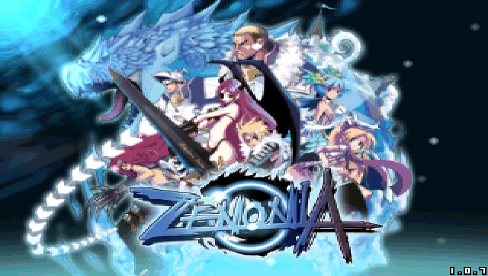

# Zenonia 1 Remaster Vita

<p align="center"></p>

This is a wrapper/port of <b>Zenonia 1 Remastered</b> for the *PS Vita*.

The port works by loading the Android ARMv7 executables from the unofficial Android remaster by Ill-Hovercraft8548 and its variants in memory, resolving their imports with native functions and patching it in order to properly run.
By doing so, it's basically as if we emulate a minimalist Android environment in which we run natively the executables as they are.

While Zenonia 1 is already available on the PlayStation Vita as a PSP Mini, this version supports a higher resolution and much better performance.

<strong>Note:</strong> Zenonia 1 is currently getting a release on [Steam](https://store.steampowered.com/app/4538960/ZENONIA_1/) and the Nintendo Switch. If you enjoy this port, please consider buying the official release through these channels as well. 

Like this port? Consider [buying me a coffee](https://ko-fi.com/withlogic)! Run into problems? Submit an issue.

## Notes

- The loader has been tested with the original Zenonia 1 Remaster release/
- Editing the config.txt file at ux0:/data/zenonia1/ yields two configuration options:
    - CapFramerate, 0 or 1. This sets the framerate to 30fps. Uncapping it allows the game to reach 60fps in some areas. Note that the game logic is tied to the framerate. 
    - GraphicsQuality, 0, 1, 2. This sets the graphics quality setting. The game defaults to its lowest setting.
- Touchscreen does NOT work currently, though the controls have been mapped to the Vita's control pad, so it should not be a problem. 
- Network menu or network options do not work.
- Some graphical errors
- The Zenonia 1 Remaster has a bug that can cause a crash if you talk to the puppy NPC. This port includes a fix to prevent the crash, but the dialogue for the puppy is Korean. You can get a copy of `StrAnimal_G.zt1` from a different version of Zenonia 1 and place it in `ux0:/data/zenonia1/assets/data/` to remedy this. This was tested with a copy of `StrAnimal_G.zt1` from the iOS version of the game.

## Controls
- Left Analog: Move
- Directional Pad: Move
- Cross: Attack / Select option in menu
- Triangle: Menu
- R Trigger: Skip story / Rotate skill bar
- Right Analog: Use Skills

## Changelog
### v.0.1

- Initial Release.

## Setup Instructions (For End Users)

- Install [kubridge](https://github.com/TheOfficialFloW/kubridge/releases/) and [FdFix](https://github.com/TheOfficialFloW/FdFix/releases/) by copying `kubridge.skprx` and `fd_fix.skprx` to your taiHEN plugins folder (usually `ux0:tai`) and adding two entries to your `config.txt` under `*KERNEL`:
  
```
  *KERNEL
  ux0:tai/kubridge.skprx
  ux0:tai/fd_fix.skprx
```

**Note** Don't install fd_fix.skprx if you're using rePatch plugin

- **Optional**: Install [PSVshell](https://github.com/Electry/PSVshell/releases) to overclock your device to 500Mhz.
- Install `libshacccg.suprx`, if you don't have it already, by following [this guide](https://samilops2.gitbook.io/vita-troubleshooting-guide/shader-compiler/extract-libshacccg.suprx).
- Install the vpk from Release tab.
- Obtain your copy of *Zenonia 1 Remaster* legally.
- Place the `Assets` and `Res`directories from the APK to `ux0:data/zenonia1`.
- Extract the files `libgameDSO.so` from the `lib/armeabi-v7a` folder to `ux0:data/zenonia1` and rename it to `libzenonia1.so`. 

## Build Instructions (For Developers)

In order to build the loader, you'll need a [vitasdk](https://github.com/vitasdk) build fully compiled with softfp usage.  
You can find a precompiled version here: https://github.com/vitasdk/buildscripts/actions/runs/1102643776.  

After all these requirements are met, you can compile the loader with the following commands:

```bash
mkdir build && cd build
cmake .. && make
```

## Credits

- [TheFloW](https://github.com/TheOfficialFlow) for the original .so loader.
- [Rinnegatamante](https://github.com/Rinnegatamante/) for VitaGL and other help with various Vita-related things
- [gl33ntwine](https://github.com/v-atamanenko/) for the awesome Android subsystem reimplementation FalsoNDK and FalsoJNI.
- [Rocroverss](https://github.com/Rocroverss) for the Livearea assets.
- Ill-Hovercraft8548 for the Zenonia 1 Remaster